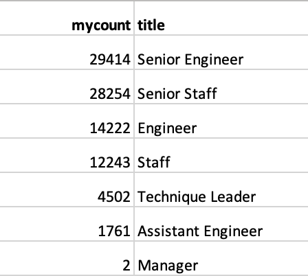
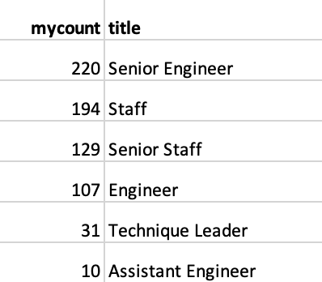
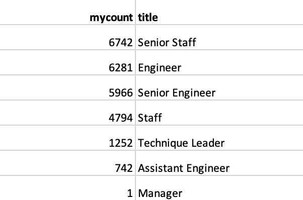

# Pewlett Hackard 

## Project Overview
### Purpose and Background
As Pewlett Hackard is a large company with thousands of baby boomers approaching retirement age, the purpose of this project is to help the company prepare for this ‘silver tsunami’. With the task of conducting employee research, data from six csv tables was used to build an employee database with sequel. The project subsequently identified upcoming retirees, the positions being vacated, and employees eligible to participate in a mentorship program. 

## Results 
Provide a bulleted list with four major points from the two analysis deliverables. Use images as support where needed.

* Number of Upcoming Retirees
There are a total of 90,398 upcoming total retirees, which is 30% of the total workforce at Pewlett Hackard. 

* Positions Opening
The majority of positions opening are for Senior Engineers (29,414) and Senior Staff (28,254). Please see Table 1 below for further information.

##### Table 1:
 

* Number of Eligible Mentors
According to the eligibility requirements, there are only 691 total eligible mentors for positions opening. Below, Table 2 provides more details. 

##### Table 2:
 

* Lack of Mentors
There is a lack of eligible mentors. At present, there are 691 qualified, retirement_ready mentors but 90,398 upcoming vacancies. 

## Summary 
A total of 90,398 roles will need to be filled as the “silver tsunami” begins to make an impact. As of now, there are 691 qualified, retirement-ready mentors. This means for every four mentors there are 523 mentees that would be trained. However, if the birth_date requirement would extend to those born between 1965 and 1968, there would be 3.5 mentees per mentor. See Table 3 below for more details. 

##### Table 3:

